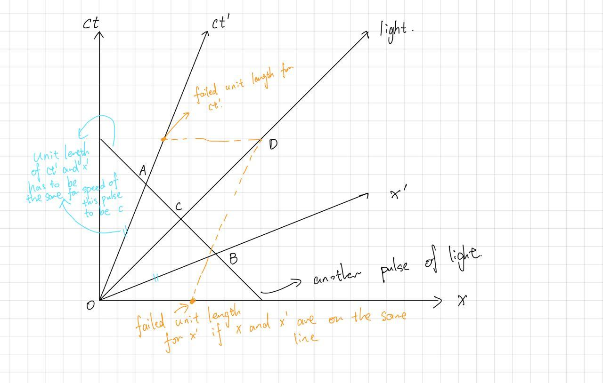
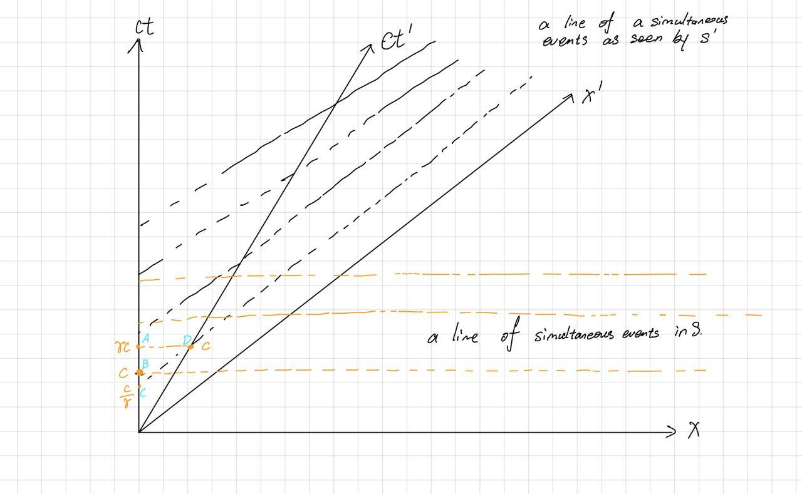
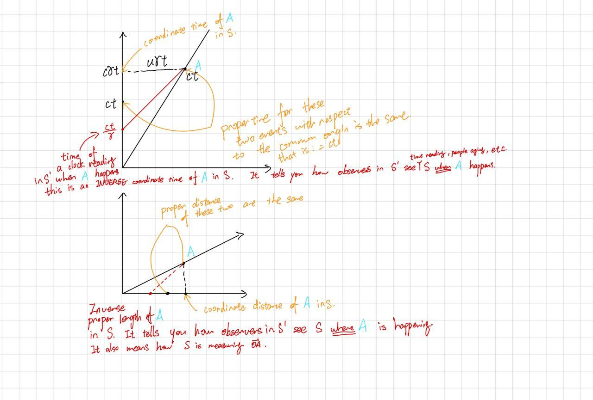

+++
title = "A graph-based note on part of the special theory of the relativity"
date = 2021-02-20
+++

> I have been reading the special relativity part of the *Feynman's Lecture on Physics*, despite not finding quite satisfied, which may happen to be caused by Mr. Feynman's mastery and intuition on Quantum Electrodynamics but not Theory of Relativity. So after days of trials, I ended up with a self-satisfied-primer-oriented explanation here.

# Background and Albert Einstein's two famous postulates
As Feynman wrote in his lecture notes, Newton's classical mechanics is invariant under Galilean transformation, which Maxwell's profound equations failed to comply with. This was quite annoying at that time cause the {{ katex(body="c") }}, the speed of light, in the equation has got unspecified reference frame. And based on people's intuition at that time, they postulated that the {{ katex(body="c") }} should be with respect to a media called ether, which is permeable in vacuum. A "brilliant" idea following that postulation is that one, by measuring the speed of light on earth, can tell the speed of earth with respect to ether. That idea was carried out in the [Michelson–Morley experiment](https://en.wikipedia.org/wiki/Michelson%E2%80%93Morley_experiment).

However, the experiment failed, there is no interference occurred in the experiment. To explain that, Feynman said "brilliant" Hendrik Lorentz found doing some mathematical tricks (namely, Lorentz transformation) can solve this. However, that is quite physically counter-intuitive.

Indeed, Einstein thought that the principle of relativity and light speed immutability (as shown by the experiment) should be both held. So, he had got two profound postulates which are our assumption for later discussions here. Two postulates are:
1. All physics laws hold in any inertial frame without difference. (Or, all inertial frames are equivalent). The inertial frame here refers to frames undergoing no acceleration.
2. The speed of light {{ katex(body="c") }} is the same under any inertial reference frame.

With these two postulates, we are interested in how would transformation from one inertial frame {{ katex(body="S") }} to another inertial frame {{ katex(body="S'") }} be like. And it turns out that transformation is the Lorentz transformation which we are about to derive later.

# Minkowski space-time diagram and the Lorentz transformation
Einstein said graphs shall be easier to work with, therefore, we are here to use graphs. One graph, invented by Minkowski, is quite helpful to study the special theory of relativity. That graph incorporates both the time {{ katex(body="t") }} and the position {{ katex(body="\vec{r}") }} to describe stuffs called events (explosion, meeting, clock-ticking, etc.) at a given position in space and a give time (that is where the word space-time comes from).

Above is a Minkowski diagram. line {{ katex(body="ct") }} is the time axis measured in meter (yes! we measure time in meter). Let us **define** the inertial reference frame {{ katex(body="S") }} as the frame formed by {{ katex(body="ct") }} and {{ katex(body="x") }}. We also **define** the unit length of both time and position axis as the "length on the axis" used to express {{ katex(body="c\ \text{meter}") }}. This means the unit length is indeed equivalent to length for which {{ katex(body="t=1\text{s}") }} and {{ katex(body="x=c\cdot 1\text{s}") }}.

Line {{ katex(body="ct'") }} is the locus of a moving particle (clock) with velocity  {{ katex(body="\vec{u}") }} seen by observer in {{ katex(body="S") }}. (it's just like a {{ katex(body="x-t") }} diagram!). Since the particle doesn't undertake any acceleration with respect to a non-accelerating inertial frame {{ katex(body="S") }}, with respect to that particle, we can also form an inertial frame called {{ katex(body="S'") }}. Then, what we need to do is to find out what the {{ katex(body="x'") }} looks like and what are the unit length of {{ katex(body="S'") }}. If we happen to know both, we can express any event (point) on the plane with respect to {{ katex(body="S'") }} using change of base in linear algebra!

We shall now see that for any inertial frame, the angles its time and position axes make with positive-sloped light pulse are the same. Firstly, draw a negative-sloped light pulse locus. Let {{ katex(body="a") }} be the unit length on {{ katex(body="ct'") }} and {{ katex(body="b") }}  be the unit length on {{ katex(body="x") }}. In order for it to have speed {{ katex(body="c") }}, we need to have {{ katex(body="\frac{|AO|}{a}=\frac{|AB|}{b}") }}. Let {{ katex(body="\vec{AD}\parallel \vec{OB}") }} and  {{ katex(body="\vec{DB}\parallel \vec{AO}") }}. Likewise, we also have to have {{ katex(body="\frac{|DO|}{a}=\frac{|DB|}{b}") }}. It follows that both  {{ katex(body="a=b") }} and  {{ katex(body="\angle{AOC}=\angle{BOC} ") }}.

Now our task is to find what  {{ katex(body="a=b ") }} is, or to find the unit length for  {{ katex(body="ct'") }}.

For this picture, we suppose there is a constant {{ katex(body="\gamma") }} such that

\begin{pmatrix}
u\gamma \\
c\gamma
\end{pmatrix} = \hat{j}

where  {{ katex(body="\hat{j}") }} is the unit vector of  {{ katex(body="S'") }}. Similarly, we define

\begin{pmatrix}
c\gamma \\
u\gamma
\end{pmatrix} = \hat{i}

One **important** feature to note here is that since all laws are held in any inertial frame, with respect to {{ katex(body="S'") }}, anything stationary in  {{ katex(body="S") }} is undergoing a constant motion with velocity  {{ katex(body="-\vec{u}") }}. That means applying same linear transformation to unit vectors  {{ katex(body="\hat{j}") }} gives a linear transformation from B to A:

M_{BA}=\gamma\begin{pmatrix}
1 & \frac{u}{c} \\
\frac{u}{c} & 1
\end{pmatrix}

Likewise, because of the reciprocity (or every inertial frame is equivalent) and {{ katex(body="S") }} moves with {{ katex(body="-\vec{u}") }} with respect to  {{ katex(body="S'") }}, we have:

M_{AB}=\gamma\begin{pmatrix}
1 & -\frac{u}{c} \\
-\frac{u}{c} & 1
\end{pmatrix}


We also have

M_{AB}M_{BA} = I

Thus,

\gamma^2\begin{pmatrix}
1 -\frac{u^2}{c^2} & 0 \\
0 & 1 -\frac{u^2}{c^2}
\end{pmatrix} = \begin{pmatrix}
1 & 0 \\
0 & 1
\end{pmatrix}

Therefore, we have

\gamma = \frac{1}{\sqrt{1-\frac{u^2}{c^2}}}

This also means the standard Lorentz transformation matrix is:

\Lambda=\gamma\begin{pmatrix}
1 & -\frac{u}{c} \\
-\frac{u}{c} & 1
\end{pmatrix}


One may be misled to write following:

-\gamma u \hat{i} + \gamma c \hat{j}=\begin{pmatrix}
0 \\
c
\end{pmatrix}

this supposes that {{ katex(body="\begin{pmatrix}-\gamma u \\ \gamma c\end{pmatrix}") }} under basis {{ katex(body="\hat{i},\hat{j}")}} is the same as {{ katex(body="\begin{pmatrix}0 \\ c\end{pmatrix}") }} under basis of  {{ katex(body="s")}}.
However, it is not true. the above equation is equivalent as writing

\begin{pmatrix}
c\gamma & u\gamma \\
u\gamma & c\gamma
\end{pmatrix}
\begin{pmatrix}
-u\gamma \\
c\gamma
\end{pmatrix}
=\begin{pmatrix}
0 \\
c
\end{pmatrix}

The first matrix cannot be shown to be equivalent to matrix  {{ katex(body="\Lambda")}}, therefore, it fails the reciprocity and should never be right at the first place.

# Relativity of simultaneity, space-time interval, proper time, and proper distance
We all happen to know famous conclusions from Special Theory of Relativity (STR) like "things are getting distorted", "we can make time pass slower", etc.

However, all of these are **seen** by one observer from one particular inertial frame. The real conclusion is that: being *always in one particular* inertial frame doesn't make you live longer (younger). Or more generally, comparing distance/time between two frames are quite meaningless actually, **unless** certain conditions fulfill.

For  {{ katex(body="S")}}, all the events on any slanted, positive-sloped line is simultaneous. However, one can easily see from the graph that this is not true for an observer in {{ katex(body="S'")}}. Vice versa.

From this point, we can see several conclusions arising.
1. for the **same event**, time for it to happen in {{ katex(body="S")}} is longer than that in  {{ katex(body="S'")}}. (time dilation).
2. for a event, the time measured in  {{ katex(body="S")}} of its **simultaneous** event in  {{ katex(body="S'")}} is shorter than the time measured of itself in  {{ katex(body="S'")}}. (this is quite alike number 4 and is indeed the reciprocal of number 1 as seen in  {{ katex(body="S'")}}).
2. for the **2 same events**, length of it in {{ katex(body="S")}} is longer than that in  {{ katex(body="S'")}}. (Yes, I know this may seem to contradict length contraction, but it is true).
3. measured at the **same time** in  {{ katex(body="S")}}, the length of **2 not necessarily same events** is shorter than that in  {{ katex(body="S'")}}. (length contraction).

We analyze these one by one.

To indeed get to understand these concepts (time dilation, length contraction, etc.), we have to **define** coordinate time, coordinate position, proper time, proper position. However, in order to define proper position/time, we have to have space-time interval first.

The space-time interval  {{ katex(body="\Delta S")}} is a quantity that is invariant under lorentz transformation.

\begin{aligned}
(\Delta S)^2 &=(c\Delta t)^2-|\Delta \vec{r}|^2 \\
(dS)^2 &=(c\cdot dt)^2-|d \vec{r}|^2
\end{aligned}

where  {{ katex(body="\vec{r} = (x,y,z)")}} is the position vector.
Under two dimensional space-time ( {{ katex(body="t")}} and  {{ katex(body="x")}}), we have equivalently:

\begin{aligned}
(\Delta S)^2 &=(c\Delta t)^2-(\Delta x)^2 \\
(dS)^2 &=(c\cdot dt)^2-(dx)^2
\end{aligned}


We also define proper time as the time measured by a clock following its movement which **may not** be inertial (i.e. **can** undergo acceleration). And this quantity should be agreed under any inertial reference frame (i.e. invariant under lorentz transformation).

We now "bind" the clock to the moving particle. Luckily, we can have a local infinitesimal-short-lasting inertial frame in which the clock (and the particle) is at rest (i.e.  {{ katex(body="d \vec{r}=\vec{0}")}}), and by definition, in that local rest frame,  {{ katex(body="dt = d\tau")}}. Therefore, assuming  {{ katex(body="(ds)^2\gt 0")}} (later we shall see that this is called time-like events),


\begin{aligned}
(ds)^2 &= (c\cdot d\tau)^2 \\
d\tau &= \frac{ds}{c}
\end{aligned}


Thus, we can see

\begin{aligned}
\tau &= \int_{locus} \frac{ds}{c} \\
&=\int^{t_2}_{t_1} \frac{\sqrt{c^2-(\frac{|d\vec{t}|}{dt})^2}}{c}\, dt \\
&=\int^{t_2}_{t_1} \sqrt{1-(\frac{v(t)}{c})^2}\, dt \\
&=\int^{t_2}_{t_1} \, \frac{dt}{\gamma(t)}
\end{aligned}


Likewise, given   {{ katex(body="(ds)^2\lt 0")}} (later we shall see that this is called space-like events), we shall have proper distance differential {{ katex(body="d\sigma")}} by

\begin{aligned}
(ds)^2 &=-(d\sigma)^2 \\
d\sigma &= \sqrt{-(ds)^2} \\
\end{aligned}

(Here we cannot write it as an integral with respect to time because time may not be a parameter to this as the locus is always have slope smaller than 1).

Now we define a few more terms.

Coordinate time for event {{ katex(body="A")}} under one inertial frame is simply the time component of that event under the frame.

Coordinate position is likewise the position component under the frame for one particular event.

Finally, we can analyze the conclusions.

As shown above, coordinate time is reason for time dilation ({{ katex(body="c\gamma t\gt ct")}}). However, the same event {{ katex(body="A")}} measured at the same place under {{ katex(body="S")}} is {{ katex(body="\frac{ct}{\gamma}\lt ct")}} (time "contraction").

Same argument can be employed for the length. However, there is a very interesting phenomenon.

In the above picture, one in {{ katex(body="S")}} can see both event (head and tail) at the same time. However, it is not the case for ones in {{ katex(body="S'")}}. They can only see either head or tail.

Do head and tail exist at the same time? It depends on your reference frame. And indeed, above example illustrates how **absurd** it is to compare phenomenons between frames together. One shall **not** do that unless things don't change, etc.

In addition to that, it is also pretty easy to see comparison between proper events makes sense if and only if both locuses start and end at the same event. It also follows that at least one of these two locus undergoes acceleration if the proper time differ. One shall be able to further prove that the one undergoing acceleration has less proper time.

Proof is like this. Take the inertial frame in which the inertial locus is in as our reference frame for the rest of the proof. Since another locus is accelerating, it has some velocity with respect to our frame. Therefore the integrand {{ katex(body="\sqrt{1-(\frac{v(t)}{c})^2}\lt 0")}} for some time intervals, resulting in a smaller area under the curve and hence proper time.

# The twin paradox
The following video explained it intuitively.
{{ youtube(id="0iJZ_QGMLD0") }}

On the other hand, proper time is shorter for accelerated clock is also a direct argument for this paradox. Brother on the ship experienced less time, but he saw brother on earth experiencing longer time (see picture with "inverse" proper time function above). Those lines are continuously sweeping out the time axis of brother-on-earth frame.

Another thing to note is that it is mathematically impossible to have a sharp turnaround because in that way {{ katex(body="\vec{r}(t)")}} is not differentiable, giving no velocity at the turning point. Even if it is possible, you will see your brother on earth age within just a snap.

You can be younger under acceleration.

# Unsolved bits
There are lots to learn in STR, namely, Relativistic dopler's effect, energy-mass equivalence, etc. I didn't cover these, but hopefully with basic tools here and infinite amount of mathematical talent, you can derive out all by yourself.

I am wondering if there is a physical explanation that relates relativity of simultaneity and the fact that information travels at the speed of light.

I didn't use a lot of mathematics here and drew a lot of graphs, because I came to understand: to learn physics well, you should see phenomenons without using heavy equations.
