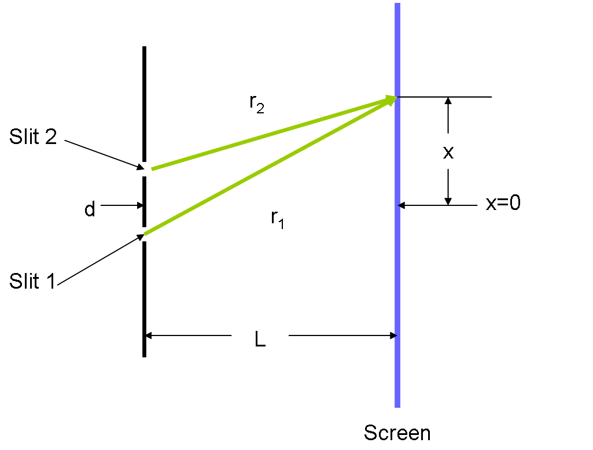

+++
title = "More rigorous deduction and proof on Young's double-slit experiment"
date = 2020-02-09
+++

> Recently, I have been studying physical optics. I found the formulas that are given in the textbook in the section of profound Young's double-slit experiment are quite "approximate". Since I always have the belief that Physics should be progressed in a mathematical manner with rigorous deductions and proofs, I decided to deduct some of the parts by myself and also try to prove the conclusions that are given in the textbook without proofs.

# What are we gonna to do?

Before our journey starts, we should first decide what to do. In this post, I will show you how to calculate the positions of any fringes on the viewing screen. Also I will show how the light intensity varies through different bright or black fringes on the screen (of course with proof!). And through the function that we acquired above, we will graph it.

# Prerequisite

We need to first define two sets


\begin{aligned}
     \Alpha &= \{2k|k\in{}\Z\}\\
     \Beta  &= \{2k+1|k\in{}\Z\}
\end{aligned}


Obviously, {{ katex(body="\Alpha") }} is the set of all the even numbers while {{ katex(body="\Beta") }} is the set of all the odd numbers. We also need to define some variables that have their own meanings.

Above is a image that illustrated the experiment.

We hereby define the {{ katex(body="d") }} as the length between two slits and {{ katex(body="\ell") }} as the length between the slits and viewing screen. Also, the {{ katex(body="\lambda") }} is for the wavelength of the light and {{ katex(body="x") }} is the postion of the intersection of the two waves on the screen (with respect to the middle point of {{ katex(body="d") }}, upper side is for positive). The upper one is {{ katex(body="r_{2}") }} and the down one is {{ katex(body="r_{1}") }}. Assume {{ katex(body="\ell\gg{}d\gg{}\lambda{}") }}. Also we are not talking about {{ katex(body="x\to{}\pm{}\infty{}") }} here, causing our approximation based on this assumption.

# General function and qualitative analysis on it.

First we need to investigate into the general function {{ katex(body="f") }} that could describe the wave at any given time {{ katex(body="t") }} with given {{ katex(body="x") }} on the screen.

For a circular wave {{ katex(body="\psi") }}, the intensity {{ katex(body="I\propto{}A^{2}") }}. And since {{ katex(body="I=\frac{P}{2\pi{}r}") }}, {{ katex(body="I\propto{}\frac{1}{r}") }}. So from two above, we could see {{ katex(body="A\propto{}\frac{1}{\sqrt{r}}") }}.

Here, in order to make it simple, for the sake of the qualitative analysis, we set the coefficient to one. From the knowledge that we acquire, at any given point, the wave would be the algebraic sum of the waves. The two waves are, in this scenario:

\begin{aligned}
    \psi_{1}(r_{1}) &= \frac{A}{\sqrt{r_{1}}}\cos{(\frac{2\pi}{\lambda}r_{1}-vt)}\\
    \psi_{2}(r_{2}) &= \frac{A}{\sqrt{r_{2}}}\cos{(\frac{2\pi}{\lambda}r_{2}-vt)}
\end{aligned}

Thus, the total wave {{ katex(body="\psi") }} would be:

\psi(r_{1},r_{2}) = \frac{A}{\sqrt{r_{1}}}\cos{(\frac{2\pi}{\lambda}r_{1}-vt)}+\frac{A}{\sqrt{r_{2}}}\cos{(\frac{2\pi}{\lambda}r_{2}-vt)}

Here goes the tricky part. Since {{ katex(body="\cos{x}") }} varies in {{ katex(body="[-1,1]") }}, the amplitude of {{ katex(body="\psi") }} would also vary in {{ katex(body="[A(|\frac{1}{\sqrt{r_{2}}}-\frac{1}{\sqrt{r_{1}}}|),A(\frac{1}{\sqrt{r_{1}}}+\frac{1}{\sqrt{r_{2}}})]") }}.

We here investigate the range of the amplitude of {{ katex(body="\psi") }} because the light intensity would be proportional to the {{ katex(body="A^{2}") }}. Thus, if we could determine the condition of being black or bright, then we could work out the positions of fringes.

In order to get {{ katex(body="A(|\frac{1}{\sqrt{r_{2}}}-\frac{1}{\sqrt{r_{1}}}|)") }}, there must be {{ katex(body="\cos{(\frac{2\pi}{\lambda}r_{1}-vt)}=-\cos{(\frac{2\pi}{\lambda}r_{2}-vt)}") }}.

And for the {{ katex(body="A(\frac{1}{\sqrt{r_{1}}}+\frac{1}{\sqrt{r_{2}}})") }}, two waves must be in phase.
Thus for the lowest amplitude,

\begin{aligned}
     (\frac{2\pi}{\lambda}r_{1}-vt)-(\frac{2\pi}{\lambda}r_{2}-vt)&=k\pi\\
     \frac{2\pi}{\lambda}(r_{1}-r_{2})&=k\pi\\
     r_{1}-r_{2}&=\frac{k\lambda{}}{2}
\end{aligned}

where {{ katex(body="k\in{}\Beta{}") }} ({{ katex(body="k\gt0") }} for upper black fringes).

On the other hand, for the highest amplitude, we must fulfill {{ katex(body="r_{1}-r_{2}=\frac{k\lambda{}}{2}") }} where {{ katex(body="k\in{}\Alpha") }} ({{ katex(body="k\leq{}0") }} for bright fringes in upper section or in perfect middle).

All in all, we could use 

\tag{1}r_{1}-r_{2}=\frac{k\lambda{}}{2}

where {{ katex(body="k\in{}\Z") }} to determine the relation between {{ katex(body="r_{1}") }} and {{ katex(body="r_{2}") }} when they form either bright or black fringes (depends on whether {{ katex(body="k\in{}\Alpha") }} or {{ katex(body="k\in\Beta") }}).

# Deduction of {{ katex(body="x") }} given the number of fringes.

From [first equation](#tag-1) that we deduced above, we now use it to work out the {{ katex(body="x") }} with given {{ katex(body="k") }}. First we could see that,

\begin{aligned}
   r_{1}&=\sqrt{(x+\frac{d}{2})^{2}+\ell^{2}}\\
   r_{2}&=\sqrt{(x-\frac{d}{2})^{2}+\ell^{2}}
\end{aligned}
Substitute them into the equation,
\begin{aligned}
    \sqrt{(x+\frac{d}{2})^{2}+\ell^{2}}-\sqrt{(x-\frac{d}{2})^{2}+\ell^{2}}&=\frac{k\lambda{}}{2}\\
    \sqrt{(x+\frac{d}{2})^{2}+\ell^{2}}&=\frac{k\lambda{}}{2}+\sqrt{(x-\frac{d}{2})^{2}+\ell^{2}}\\
    (x+\frac{d}{2})^{2}+\ell^{2}&=\frac{k^{2}\lambda^{2}}{4}+k\lambda{}\sqrt{(x-\frac{d}{2})^{2}+\ell^{2}}+(x-\frac{d}{2})^{2}+\ell^{2}\\
    2xd-\frac{k^{2}\lambda^{2}}{4}&=k\lambda{}\sqrt{(x-\frac{d}{2})^{2}+\ell^{2}}\\
    (2xd-\frac{k^{2}\lambda^{2}}{4})^{2}&=k\lambda{}(x^{2}-xd+\frac{d^{2}}{4}+\ell^{2})\\ 4x^{2}d^{2}-xdk^{2}\lambda^{2}+\frac{k^{4}\lambda^{4}}{16}&=k^{2}\lambda^{2}x^{2}-k^{2}\lambda^{2}xd+\frac{k^{2}\lambda^{2}d^{2}}{4}+k^{2}\lambda^{2}\ell^{2}\\
    (4d^{2}-k^{2}\lambda^{2})x^{2}&=\frac{4k^{2}\lambda^{2}d^{2}+16k^{2}\lambda^{2}\ell^{2}-k^{4}\lambda^{4}}{16}\\
    x^{2}&=\frac{4k^{2}\lambda^{2}d^{2}+16k^{2}\lambda^{2}\ell^{2}-k^{4}\lambda^{4}}{16(4d^{2}-k^{2}\lambda^{2})}\\
    x&=\pm\sqrt{\frac{k^{2}\lambda^{2}}{16}}\sqrt{\frac{4d^{2}+16\ell^{2}-k^{2}\lambda^{2}}{4d^{2}-k^{2}\lambda^{2}}}\\
    x&=\pm\frac{k\lambda}{4}\sqrt{\frac{4d^{2}+16\ell^{2}-k^{2}\lambda^{2}}{4d^{2}-k^{2}\lambda^{2}}}
\end{aligned}

Since the {{ katex(body="x") }} is too complicated, we need to do one approximation to that. Since {{ katex(body="\ell{}\gg{}d\gg{}\lambda{}") }},

\begin{aligned}
    x&\approx\pm\frac{k\lambda}{4}\sqrt{\frac{16\ell^{2}}{4d^{2}}}\\
    &=\pm\frac{k\lambda{}\ell}{2d}
\end{aligned}

Since {{ katex(body="x=-\frac{k\lambda{}\ell}{2d}") }} doesn't fulfill the original equation, the final solution to that would be: 

\tag{2}x=\frac{k\lambda{}\ell}{2d}

Equation above would be quite useful for you to determine the position of the fringes.

# Light intensity function

Based on what we have discussed in first section, the function of light intensity {{ katex(body="I") }} is

I(k)=\epsilon^{2}A^{2}(\frac{1}{\sqrt{r_{1}}}+(-1)^{k}\frac{1}{\sqrt{r_{2}}})^{2}

where {{ katex(body="\epsilon") }} is the coefficient of proportion. (Here we don't care about the relative order of {{ katex(body="r_{1}") }} and {{ katex(body="r_{2}") }} since they are ultimately squared).

Based on the {{ katex(body="x") }} that we acquired [above](#tag-2), we could work out {{ katex(body="r_{1}") }} and {{ katex(body="r_{2}") }}.

\begin{aligned}
    r_{1}&=\sqrt{\frac{(k\lambda{}\ell+d^{2})^{2}+4d^{2}\ell^{2}}{4d^{2}}}\\
    r_{2}&=\sqrt{\frac{(k\lambda{}\ell-d^{2})^{2}+4d^{2}\ell^{2}}{4d^{2}}}
\end{aligned}

Thus, 

\tag{3}I(k)=(\epsilon A\frac{1}{[\frac{(k\lambda{}\ell+d^{2})^{2}+4d^{2}\ell^{2}}{4d^{2}}]^{\frac{1}{4}}}+(-1)^{k}\frac{1}{[\frac{(k\lambda{}\ell-d^{2})^{2}+4d^{2}\ell^{2}}{4d^{2}}]^{\frac{1}{4}}})^{2}

where {{ katex(body="k\in{}\Z") }}.

We now graph separately the function when {{ katex(body="k\in{}\Beta") }} and {{ katex(body="k\in{}\Alpha") }} (**Following is not drawn to scale, only represents trend**).

On the graph, the green graph is ({{ katex(body="k\in{}\Alpha") }}) and the purple one is ({{ katex(body="k\in{}\Beta{}") }}) As you can see, as the {{ katex(body="k") }} goes along the either side of {{ katex(body="x") }} axis, the
value of green one will go smaller.

## Proof

Here we will prove under **approximation**, the light intensity of bright fringes will go smaller and the intensity of black ones will stay {{ katex(body="0") }}. It's actually not precise but I can only find the proof to this extend. I have been finding the proof without compromising the beauty of mathematics for almost two days. But it turned out to be nothing based on my ability.

So how to prove?

Since we are doing qualitative analysis, we may first simplify the [third equation](#tag-3). It could be

I(k)=(\frac{1}{[\frac{(k\lambda{}\ell+d^{2})^{2}+4d^{2}\ell^{2}}{4d^{2}}]^{\frac{1}{4}}}+(-1)^{k}\frac{1}{[\frac{(k\lambda{}\ell-d^{2})^{2}+4d^{2}\ell^{2}}{4d^{2}}]^{\frac{1}{4}}})^{2}

Now focus on

\frac{(k\lambda{}\ell\pm{}d^{2})^{2}+4d^{2}\ell^{2}}{4d^{2}}

We have

\begin{aligned}
   r_{1}=&\frac{(k\lambda{}\ell+d^{2})^{2}+4d^{2}\ell^{2}}{4d^{2}}\\
   =&\frac{k^{2}\lambda{}^{2}\ell^{2}+2d^{2}k\lambda{}\ell+d^{4}+\ell^{2}}{4d^{2}}\\
   =&\frac{k^{2}\lambda{}^{2}\ell^{2}+2d^{2}(k\lambda{}\ell{}+d^{2}+2\ell^{2})}{4d^{2}}\\
   =&\frac{k^{2}\lambda{}^{2}\ell^{2}+2d^{2}[2\ell{}(k\lambda{}+\ell)+d^{2}]}{4d^{2}}\\
   \approx{}&\frac{k^{2}\lambda{}^{2}\ell^{2}+2d^{2}(2\ell{}^{2}+d^{2})}{4d^{2}}\\
   \approx{}&\frac{k^{2}\lambda{}^{2}\ell^{2}+2d^{2}(2\ell{}^{2})}{4d^{2}}\\
   ={}&\frac{k^{2}\lambda{}^{2}\ell^{2}+4d^{2}\ell{}^{2}}{4d^{2}}
\end{aligned}

Similarly,

\begin{aligned}
   r_{2}=&\frac{(k\lambda{}\ell-d^{2})^{2}+4d^{2}\ell^{2}}{4d^{2}}\\
   =&\frac{k^{2}\lambda{}^{2}\ell^{2}-2d^{2}k\lambda{}\ell+d^{4}+\ell^{2}}{4d^{2}}\\
   =&\frac{k^{2}\lambda{}^{2}\ell^{2}+2d^{2}(-k\lambda{}\ell{}+d^{2}+2\ell^{2})}{4d^{2}}\\
   =&\frac{k^{2}\lambda{}^{2}\ell^{2}+2d^{2}[2\ell{}(-k\lambda{}+\ell)+d^{2}]}{4d^{2}}\\
   \approx{}&\frac{k^{2}\lambda{}^{2}\ell^{2}+2d^{2}(2\ell{}^{2}+d^{2})}{4d^{2}}\\
   \approx{}&\frac{k^{2}\lambda{}^{2}\ell^{2}+2d^{2}(2\ell{}^{2})}{4d^{2}}\\
   ={}&\frac{k^{2}\lambda{}^{2}\ell^{2}+4d^{2}\ell{}^{2}}{4d^{2}}
\end{aligned}

Under this scenario, {{ katex(body="r_{1}=r_{2}") }}, thus it's obvious that the black fringes are {{ katex(body="0") }} intensified.

And for the bright fringes,

\frac{d}{dk}I=-\frac{4 \, \left(\frac{1}{4}\right)^{\frac{3}{4}} k l^{2} m^{2}}{d^{2} \left(\frac{k^{2} l^{2} m^{2} + 4 \, d^{2} l^{2}}{d^{2}}\right)^{\frac{5}{4}}}

For {{ katex(body="k\lt0") }}, {{ katex(body="\frac{d}{dk}I\gt0") }}, while {{ katex(body="k\gt0") }}, {{ katex(body="\frac{d}{dk}I\lt0") }} and {{ katex(body="k=0") }}, {{ katex(body="\frac{d}{dk}I=0") }}, by which we can say that the light is at its peak when {{ katex(body="k=0") }}.

# Conclusion

I found out its just crazy to apply math to physics. I am too tired because of this. If you like it, please buy me a cup of coffee.
