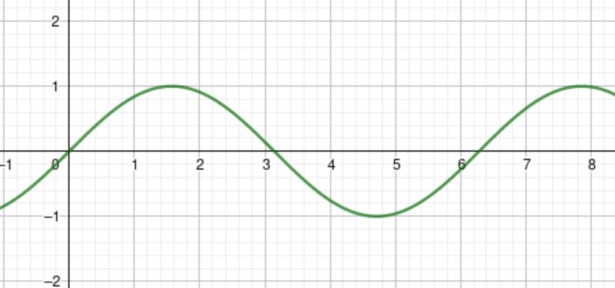

+++
title = "Review of Electrostatics and Electromagnetism"
date = 2020-01-25
+++

> It has been a long time since I planned to write this review. This post covers Electrostatics, Circuit, Magnetism and Electromagnetism in my own structure of understanding of all above. And since the post is guided by neither teachers nor guiders, content may **not** be correct.

# Electrostatics

## Charges and its related concepts.

Charge is the bedrock of understanding all the concepts inelectrostatics and even further, because it relates to the electric field and electric potential.

### Electric Charge

According to [Wikipedia](https://en.wikipedia.org/wiki/Electric_charge), electric charge is the physical property of matter that causes it to experience a force when placed in an electromagnetic field. The charge can be grouped by either positive or negative. More specifically:

-   positive: rubbed glass rod.
-   negative: rubbed plastic ruler (amber).

And the charges have the trait that **unlike charges attract, like charges repel.**

The unit of the amount of the charge is Coulomb, annotated as {{ katex(body="\text{C}") }}, where {{ katex(body="\text{C}=\text{A}\times\text{s}") }}

The amount of charges of one proton is notated as {{ katex(body="e") }}, where {{ katex(body="e=1.6022\times{}10^{-19}\text{C}") }}.

The electric charge is quantized, meaning no fraction of {{ katex(body="e") }} could be gained.

### Law of Conservation of electric charge

This is another version of conservation of energy in the field of electrostatics. It states that:

> No **net** electric charge can be created or destroyed.

Remember the thing that it states is about is **net** charge. Thus it doesn't mean that there is no way to get something charged.

### Ways to get something charged

#### Induction
*Induction* means to induce the charge while not truly give away the existing ones on one particular object.

There are two ways of doing so.

- Induction by separation
One positive charged object approaches another neutralized object. Since **unlike charges attract, like charges repel**, the near end of neutralized object would accumulate a group of negative charges, while the positive charges are repelled. If you now cut the original neutralized object in the middle, you can get one positive charged and one negative charged object out of it.

- Induction by grounding
Same approach as above, instead of cutting it in the middle, we wire the far end of it to the ground.

#### Conduction
One charged conductor contacts another uncharged **conductor**. Note that **conductor** in the ideal way implies that electrons can move in it **almost** freely (Resistivity {{ katex(body="\to{}0^{+}") }}).

## Force and field by charges

### Coulomb's law

F=k\frac{Q_{1}Q_{2}}{r^{2}}

where {{ katex(body="k=\frac{1}{4\pi{}\varepsilon_{0}}") }}. And {{ katex(body="\varepsilon_{0}=8.85\cdot{}10^{-12}\frac{\text{C}^{2}}{\text{N}\cdot{}\text{m}^{2}}") }} is the permittivity of free space.

**NOTE: For static situation only**. The direction of {{ katex(body="\vec{F}") }} follows the rule of the attraction and repelement between charges.

### Electric field

This is a manmade concept which is deduced from the electric force.

\vec{E}=\frac{\vec{F}}{q}

E=k\frac{Q}{r^{2}}

As long as the {{ katex(body="q") }} doesn't exert a large force on {{ katex(body="Q") }} that could move {{ katex(body="Q") }}, we can calculate {{ katex(body="\vec{F}=q\vec{E}") }}.

### Electric Field Lines (EFL)

EFL has these three traits:

1. EFL indicates the directions of the electric field.
2. number of the EFLs passing through a given area which is normal to EFLs, is proportional to the magnitude of {{ katex(body="\vec{E}") }}.
3. The number of lines pointing to the nodes is proportional to the magnitude of the electric charge of the node.

### Electric Field and Conductor (static)

1. {{ katex(body="\sum{}\vec{E}=0") }} inside the conductor.
Refer to the [MIT Lecture Notes](https://web.mit.edu/sahughes/www/8.022/lec05.pdf).

2. External {{ katex(body="\vec{E}") }} is at normal at every point on the surface of the conductor.

If the tangential component of the external {{ katex(body="\vec{E}") }} is present at the point(s) of the surface. The charge(s) at these point(s) will flow along the surface in the direction of the {{ katex(body="\vec{E}") }} (opposite if {{ katex(body="q") }} is negative), resulting in a **dynamic** situation rather than a **static** one. On the other hand, if only perpendicular component of {{ katex(body="\vec{E}") }} exists, the force made by {{ katex(body="\vec{E}") }} can be cancelled out by other forces (like normal force).

3. All the charges reside on the surface of the conductor under external {{ katex(body="\vec{E}") }}. From the Gauss's Law, we can define a Gaussian surface rigorousl inside the conductor (not including surface). For that surface:

\sum{}E_{\perp}\Delta{}A=\frac{Q_{enclosed}}{\varepsilon_{0}}

since the {{ katex(body="\sum{}\vec{E}") }} is {{ katex(body="0") }} inside conductor:

\sum{}E_{\perp}\Delta{}A=0=\frac{Q_{enclosed}}{\varepsilon_{0}}

Therefore, {{ katex(body="Q_{enclosed}") }} equals to 0.

## Guass's Law

### Deduction

First we define electric flux {{ katex(body="\Phi_{E}") }} as:

\Phi_{E}=\vec{A}\cdot{}\vec{E}=EA\cos{\theta}=EA_{\perp{}}

As [second rule of EFL](#rule2) stated, {{ katex(body="E\propto{}\frac{N}{A_{\perp{}}}") }}.

Thus, {{ katex(body="EA_{\perp{}}=\Phi_{E}\propto{}N") }}. And since {{ katex(body="Q_{enclosed}\propto{}N") }}, {{ katex(body="Q_{enclosed}\propto{}\Phi_{E}") }}. So for a enclosed surface in the space (we choose {{ katex(body="\frac{1}{\varepsilon_{0}}") }} as the constant of proportionality),

\sum{}E_{\perp}\Delta{}A=\frac{Q_{enclosed}}{\varepsilon_{0}}

If we choose symmetric Gaussian surface, we could rewrite,

\sum{}E_{\perp}\Delta{}A=E_{\perp}\sum{}\Delta{}A

since {{ katex(body="E_{\perp}") }} should remain constant in every angle.

## Electric Potential Energy and Potential

Suppose there is situation that one charge is being moved from point {{ katex(body="a") }} to {{ katex(body="b") }} under uniform{{ katex(body="\vec{E}") }} (Uniform electric field)

\begin{aligned}
    \because{}&W_{C}=-\Delta{}\text{PE}=-q(V_{b}-V_{a})=-qV_{ba}=Fd=qEd\\
	\therefore{}&E=-\frac{V_{ba}}{d}
\end{aligned}

where {{ katex(body="\vec{E}") }} points in the direction of decreasing {{ katex(body="V_{ba}") }}.

By using Calculus, we can deduce the electric potential at point in the space due to point charge is: ({{ katex(body="V") }} approaches 0 as r approaches infinity, plug sign in)

V=k\frac{Q}{r}

## Capacitance and Dielectrics

### Capacitance

Capacitance is a device that can store electric charge, consists of two conductors (plates).
The charge required by each plate is:

Q=CV

where {{ katex(body="V") }} is the potential difference between plates. Here we will deduce the capacitance
{{ katex(body="C") }} from the Gauss's Law.
We choose the surface around the positive charged plate as our Gaussian surface. The Right-hand-side of the Guass's Law, which is {{ katex(body="\sum{}E_{\perp}\Delta{}A") }} would be {{ katex(body="E_{\perp}\sum\Delta{}A") }} since the {{ katex(body="\vec{E}") }} is uniform. Also, we only have one side of the plates to emit the {{ katex(body="\vec{E}") }}. Thus, after all, the {{ katex(body="E_{\perp}\sum\Delta{}A=EA\cos{\theta}") }} where the {{ katex(body="A") }} is the area of one side of the plate. And furthermore, the {{ katex(body="\vec{E}") }} is perpendicular to the surface area, hence,

E=\frac{Q}{A\varepsilon_{0}}

We also have,

\tag{V>0}E=\frac{V}{d}

In all,

\tag{V>0}\begin{aligned}
    \because{}\frac{V}{d}&=\frac{Q}{A\varepsilon_{0}} \\
    \therefore{}Q&=\frac{A\varepsilon_{0}}{d}V\\
    \therefore{}C&=\frac{A\varepsilon_{0}}{d}
\end{aligned}

The unit of capacitance {{ katex(body="C") }} is {{ katex(body="\text{F}") }}. {{ katex(body="\text{F}=\frac{\text{C}^{2}}{\text{N}\cdot{}\text{m}}=\frac{\text{A}^{2}\cdot{}\text{s}^{2}}{\text{N}\cdot{}\text{m}}=\frac{\text{A}^{2}\cdot{}\text{s}^{4}}{\text{kg}\cdot{}\text{m}^{2}}") }}

### Dielectrics

Also there is one kind of materials that has multiple enhancements for capacitance. It's called Dielectrics which is between the conductors (plates). 

Typically, it has three benefits for capacitance:

1. Two plates can be applied by high enough voltage without breaking down.
2. Conductors can be put close enough without touching each other.
3. Amplify capacitance by constant {{ katex(body="K") }}, which means {{ katex(body="C=K\varepsilon_{0}\frac{A}{d}") }}.

### Energy stored in capacitance.

\text{W}_{\text{NC}}=qV_{ba}=\frac{1}{2}QV=\frac{1}{2}CV=\frac{Q^{2}}{2C}

# Electric Circuit

Here I omit some easy knowledge. So we first start with alternating
current.

## Alternating Current

For an alternating current system,

V=V_{0}\sin{2\pi{}ft}=V_{0}\sin{\omega{}t}

Therefore,

I=\frac{V}{R}=\frac{V_{0}\sin{\omega{}t}}{R}=I_{0}\sin{\omega{}t}

P=I^{2}R=I^{2}_{0}R\sin^{2}{\omega{}t}

From the Calculus, we can know that {{ katex(body="\overline{\sin^{2}{x}}=\frac{1}{2}") }}. Thus,

\overline{P}=\frac{1}{2}I_{0}^{2}R

Also, the rms (root-mean-square) of both {{ katex(body="I") }} and {{ katex(body="V") }} is very important.

I_{rms}=\sqrt{\overline{I^{2}}}=\frac{I}{\sqrt{2}}

V_{rms}=\sqrt{\overline{V^{2}}}=\frac{V}{\sqrt{2}}

\overline{P}=I_{rms}V_{rms}

# Magnetism

## Basics of magnetic poles

Like the charges, there are also two types of poles (north and south). And they follow the rule of **unlike poles attract, like poles repel**. There is **no** single pole magnet until now.

## Ampere's law

The law states that

\sum{}B_{\|}\Delta{}\ell=\mu{}_{0}I_{enclosed}

which means "Around a closed path, the sum of the component of the magnetic field tangent to the direction of the path equals {{ katex(body="\mu{}_{0}") }} times the **net** current intercepted by the area within the path."

## Magnetic field, current, and force because of it

Like electric field, magnets produce (induce) magnetic filed, which is denoted as {{ katex(body="\vec{B}") }}. It is a vector and the unit of it is {{ katex(body="\text{T}") }}, tesla.

\begin{aligned}
   \text{T}&=\frac{\text{kg}\cdot{}\text{m}\cdot{}\text{s}^{-2}}{\text{C}\cdot{}\text{m}\cdot{}\text{s}}\\
   &=\frac{\text{kg}}{\text{C}\cdot{}\text{s}}\\
   &=\frac{\text{kg}}{\text{A}\cdot{}\text{s}^{2}}
\end{aligned}

It has been found that the electric current can produce electric field around it. The magnitude of it is deduced as below.

\begin{aligned}
    \sum{}B_{\|}\Delta{}\ell&=\mu{}_{0}I_{enclosed}\\
    B\cdot{}2\pi{}r&=I\mu{}_{0}\\
    B&=\frac{\mu_{0}I}{2\pi{}r}
\end{aligned}

The direction of the {{ katex(body="\vec{B}") }} follows the right hand rule 1 which is "use your right hand to grasp the current in the way that thumb points in the direction of current, the direction of rest of four fingers would be the direction".

It has also been found that for the current-carrying wire under {{ katex(body="\vec{B}") }}, the wire will be subjected to the force exerted by magnetic
field.

\vec{F}=I\vec{\ell}\times{}\vec{B}

where {{ katex(body="\vec{\ell}") }} is a vector whose magnitude is the length of the wire in the field and whose direction is the direction of the wire.

The direction of the {{ katex(body="\vec{F}") }} follows the direction rule for the cross product of two vectors.

The previous expression could also be used to deduce the force on charges under field.

\begin{aligned}
   I\vec{\ell}\times{}\vec{B}&=\frac{nq}{t}\cdot{}\vec{v}t\times{}\vec{B}\\
   &=nq\vec{v}\times{}\vec{B}
\end{aligned}

In particular, for a single charge (n=1), it can be written in the manner that {{ katex(body="q\vec{v}\times{}\vec{B}") }}.

The magnitude of {{ katex(body="\vec{F}") }} would be {{ katex(body="nqvB\sin{\theta}") }}. And from here we can get the expression which defines the magnitude of {{ katex(body="\vec{B}") }}.

B=\frac{F}{nqv\sin{\theta}}

## Induced emf

### Magnetic flux

It has been found that the emf could be induced by a changing magnetic field. For quantitative analysis, we define magnetic flux {{ katex(body="\Phi_{B}") }} similar to electric flux {{ katex(body="\Phi_{E}") }}. (Direction of area could be chosen from either of the surfaces of the area {{ katex(body="\vec{A}") }}. It doesn't matter as long as it is consistent.)
\Phi_{B}=\vec{B}\cdot{}\vec{A}

### Faraday's law

And according to the Faraday's law, at any given time {{ katex(body="t") }}, the induced emf is equal to the instantaneous rate of change of **magnetic flux through the area inside made by closed circuit**. Here we express magnetic flux inside as a function of {{ katex(body="t") }}, {{ katex(body="\Phi_{B}^{inside}=a(t)") }}.

\mathcal{E}=-N\frac{d}{dt}a(t)

where {{ katex(body="N") }} is the number of the turn of the circuit.

Here I have to use the derivative form of the Faraday's law cause it's vital to express it as *instantaneous* rate of change.

#### AC Generator
And we can continue to do some work on the equation above if we are analyzing the AC generator. Since the {{ katex(body="\mathcal{E}") }} is
changing continuously, we can rewrite {{ katex(body="\mathcal{E}") }} in the form of a function. Suppose the area {{ katex(body="\vec{A}") }} that is formed by the circuit, orients the east direction at the beginning. And the {{ katex(body="\vec{B}") }} is uniform and parallel along the horizontal axis in the space. So at any given time {{ katex(body="t") }}, the angle that is made by the {{ katex(body="\vec{A}") }} and {{ katex(body="\vec{B}") }} is {{ katex(body="\theta{}=\omega{}t") }}.

Thus:
\Phi_{B}=a(t)=BA\cos{\omega{}t}

For the sake of discussion, we set {{ katex(body="N=1") }}, so the Faraday's law under this scenario would be:

\mathcal{E}=-\frac{d}{dt}a(t)=-\frac{d}{dt}BA\cos{\omega{}t}=\omega{}BA\sin{\omega{}t}

Or, in terms of {{ katex(body="\theta") }}:

\mathcal{E}=\omega{}BA\sin{\theta{}}

Above is the graph of {{ katex(body="\sin{\theta}") }}. And we can spot out that the sign of {{ katex(body="\mathcal{E}") }} changes every {{ katex(body="\pi{}") }}, which means the direction of current in the circuit changes every half revolution. Also, we can see that the current is at its peak when

\theta{}\in{} \{\frac{\pi}{2}k:k=2x+1,x\in{}\Z \}

And the conclusion above also holds for different situations in which circuit kicks off in different positions.

### The direction of the current induced by changing magnetic field.

**No Lenz's Law needed!** It is possible to determine the direction of emf or current without using Lenz's law. The only thing you need is to use the so-called "Left hand rule of Faraday's law".

Point your left hand's thumb in the direction of {{ katex(body="\vec{A}") }}.

If the sign of {{ katex(body="\frac{d}{dt}a(t)") }} is positive (**WITHOUT MINUS SIGN AHEAD!**), then the direction of your rest four fingers is the direction
of the current.

If the sign of it is negative, then the direction of the current of the circuit would be in the opposite direction of your rest four fingers.
